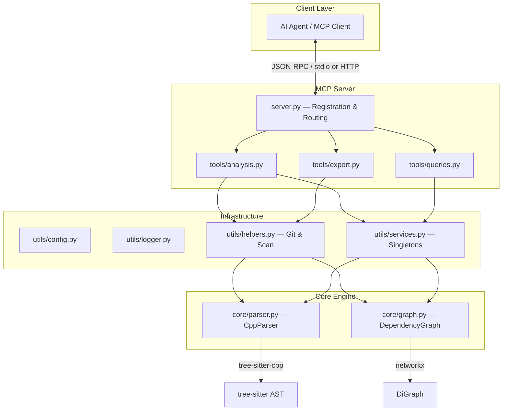
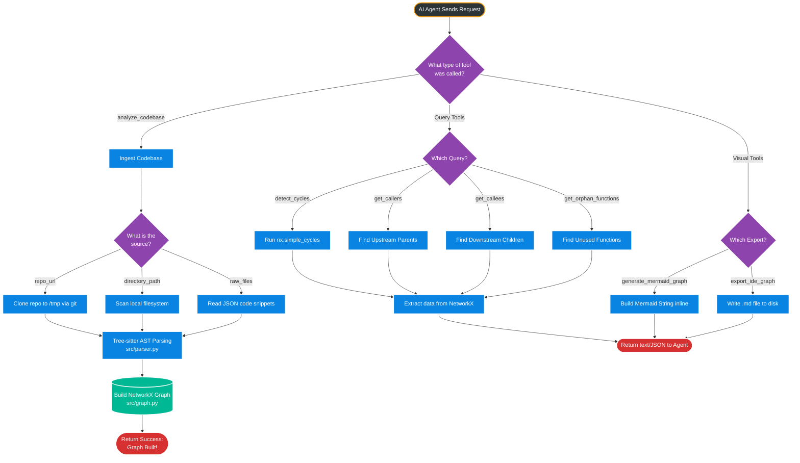
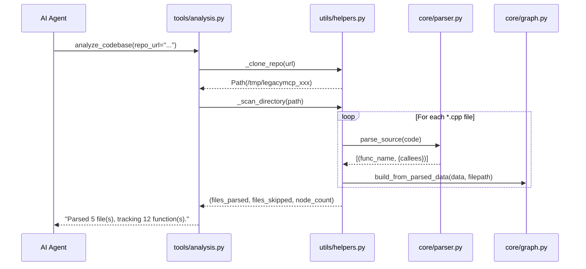
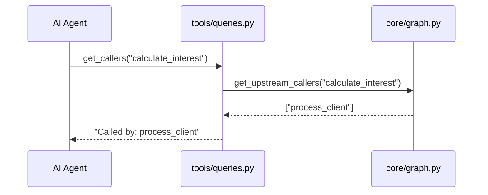
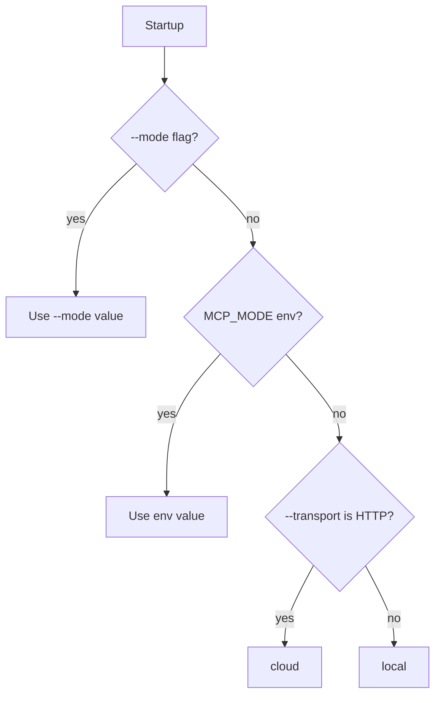

# Architecture — LegacyGraph-MCP

This document describes the internal architecture, data flows, and design decisions behind LegacyGraph-MCP.

---

## 1. High-Level Architecture



---

## 2. End-to-End Workflow

This flowchart illustrates the complete lifecycle of an Agent interacting with the system: from parsing code, to extracting insights, to formatting results.



---

## 3. Package Structure

```
src/
├── __init__.py          Package root
├── __main__.py          CLI entry point (argparse → mode → transport → mcp.run)
├── server.py            FastMCP init, tool registration, server card
│
├── core/                Business logic (zero framework dependencies)
│   ├── graph.py         DependencyGraph wrapping networkx.DiGraph
│   └── parser.py        CppParser wrapping tree-sitter-cpp
│
├── tools/               MCP tool functions (one concern per file)
│   ├── analysis.py      analyze_codebase — ingestion workflows
│   ├── queries.py       get_callers, get_callees, detect_cycles, etc.
│   └── export.py        generate_mermaid_graph, export_ide_graph
│
└── utils/               Cross-cutting infrastructure
    ├── config.py         Runtime config: MCP_MODE, CPP_EXTENSIONS
    ├── logger.py         Centralized logging setup
    ├── services.py       Global singletons (graph_service, parser_service)
    └── helpers.py        _clone_repo, _scan_directory, _build_mermaid_string
```

### Design Principles

| Principle | Implementation |
|---|---|
| **Separation of Concerns** | Core logic has no MCP imports; tools have no graph algorithms |
| **Dependency Direction** | `tools → utils → core` (never reversed) |
| **Thin Server** | `server.py` is ~150 lines — registration only, no business logic |
| **Testability** | Core classes are independently instantiable without MCP |
| **Singleton Access** | `utils/services.py` holds mutable module-level state, avoiding circular imports |

---

## 3. Data Flow

### Ingestion Pipeline



### Query Pipeline



---

## 4. Core Components

### `core/parser.py` — CppParser

- **Technology:** tree-sitter with `tree-sitter-cpp` bindings
- **Query strategy:** Uses tree-sitter's `Query` API with patterns `(function_definition)` and `(call_expression)` — tolerant of syntax errors
- **Output:** `List[Tuple[str, Set[str]]]` — function name → set of called functions
- **Robustness:** Handles broken C++, forward declarations, pointer/reference declarators, qualified identifiers

### `core/graph.py` — DependencyGraph

- **Technology:** `networkx.DiGraph`
- **File-awareness:** Every node carries a `file` attribute for per-file isolation
- **Key operations:**

| Method | Complexity | Description |
|---|---|---|
| `build_from_parsed_data` | O(V + E) | Populate graph from parser output |
| `detect_cycles` | O(V + E) | `nx.simple_cycles` |
| `get_upstream_callers` | O(degree) | `graph.predecessors()` |
| `get_downstream_dependencies` | O(degree) | `graph.successors()` |
| `get_file_subgraph` | O(V) | Filter nodes by `file` attribute |
| `get_cross_file_dependencies` | O(E) | Find edges crossing file boundaries |
| `get_orphan_functions` | O(V) | Nodes with in-degree = 0 |

---

## 5. Mode System

The server operates in two modes, resolved at startup with this priority chain:

```
--mode flag  →  MCP_MODE env var  →  auto-detect from --transport  →  default "local"
```



### Mode Differences

| Aspect | Local | Cloud |
|---|---|---|
| Transport | `stdio` | `streamable-http` |
| `directory_path` | ✅ Allowed | ❌ Blocked |
| `export_ide_graph` | ✅ Registered | ❌ Hidden |
| Repo cloning | To local Path | To `/tmp/` (ephemeral) |

---

## 6. Tool Registration

Tools are **not** decorated with `@mcp.tool()` at definition time. Instead, `_register_tools(mode)` is called from `__main__.py` after mode resolution, enabling conditional tool exposure:

```python
# server.py
def _register_tools(mode: str) -> None:
    mcp.tool()(analyze_codebase)     # Always
    mcp.tool()(get_callers)          # Always
    # ...
    if mode == "local":
        mcp.tool()(export_ide_graph) # Local only
```

This prevents cloud-deployed instances from ever advertising local-only tools.

---

## 7. Server Card

The `/.well-known/mcp/server-card.json` endpoint dynamically reflects the current mode and available tools:

```json
{
  "serverInfo": { "name": "legacy-mcp-analyzer", "version": "0.3.0" },
  "capabilities": { "modes": ["local", "cloud"], "currentMode": "local" },
  "tools": [...]
}
```

---

## 8. Error Handling Strategy

| Layer | Pattern |
|---|---|
| **Parser** | Raises `ParseError` — never crashes on invalid C++ |
| **Graph** | Raises `GraphError` for missing nodes — caught by tools |
| **Tools** | Return user-friendly error strings (never raise to MCP layer) |
| **Helpers** | Raise `RuntimeError` for git failures — caught by `analyze_codebase` |

---

## 9. Dependencies

| Package | Version | Purpose |
|---|---|---|
| `tree-sitter` | ^0.23.0 | Incremental parsing framework |
| `tree-sitter-cpp` | ^0.23.0 | C++ grammar for tree-sitter |
| `networkx` | ^3.2.1 | Directed graph data structure |
| `mcp` / `fastmcp` | ^1.0.0 | MCP server framework |
| `uvicorn` | ^0.41.0 | ASGI server for HTTP mode |
| `starlette` | ^0.52.1 | HTTP routing (server card) |
