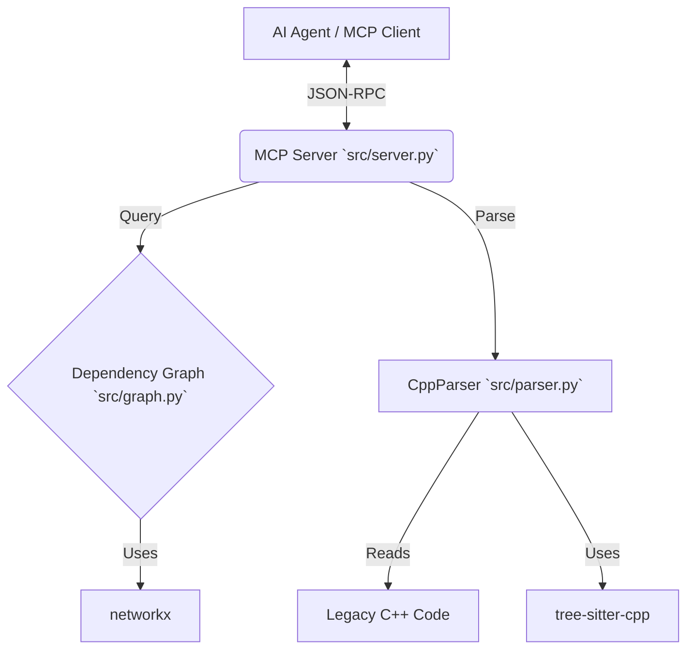

# LegacyGraph-MCP Project Manual

## 1. Project Overview
LegacyGraph-MCP is a tool designed to bridge the gap between AI Agents and legacy C++ codebases. By exposing a code dependency graph via the Model Context Protocol (MCP), it allows LLMs to "reason" about code structure rather than just reading text.

### Key Capabilities
- **Robust Parsing:** Handles dirty/broken C++ code using `tree-sitter`.
- **Structural Analysis:** Maps function call graphs (Caller/Callee relationships).
- **Cycle Detection:** Identifies recursion and spaghetti code loops.
- **Agent Integration:** Standardized MCP interface for tools like Claude Desktop or custom agents.

## 2. Hands-on Guide

### Prerequisites
- Python 3.11+
- Poetry (for dependency management)

### Installation
```bash
git clone https://github.com/RohitYadav34980/LegacyGraph-MCP.git
cd LegacyGraph-MCP
poetry install
```

### Running the Server
To start the MCP server locally:
```bash
poetry run python -m src.server
```
The server works over Stdio. It will wait for MCP JSON-RPC messages.

### Verifying Installation
Run the included verifier script (requires a test codebase in `data/`):
```bash
# First, create a dummy C++ file
mkdir -p data/legacy_project
echo "void f() { g(); } void g() {}" > data/legacy_project/main.cpp

# Run the verifier (Simulates an MCP Client)
poetry run python tools/verifier.py
```

## 3. Architecture

### High-Level Design


### Component Breakdown

#### `src/parser.py` (Ingestion Layer)
- **Class:** `CppParser`
- **Purpose:** Extracts function signatures and call sites.
- **Key Method:** `parse_source(code: str) -> List[Tuple[str, Set[str]]]`
- **Robustness:** Uses tree-sitter Queries `(function_definition)` and `(call_expression)` to tolerate syntax errors.

#### `src/graph.py` (Analysis Layer)
- **Class:** `DependencyGraph`
- **Purpose:** Directed Graph data structure for dependencies.
- **Key Methods:**
    - `detect_cycles()`: Finds recursive loops.
    - `get_upstream_callers(func)`: Who calls `func`?
    - `get_downstream_dependencies(func)`: Who does `func` call?

#### `src/server.py` (Interface Layer)
- **Framework:** `mcp` (FastMCP)
- **Tools Exposed:**
    - `analyze_codebase`: Triggers parsing.
    - `get_callers`: Agent tool for upstream analysis.
    - `get_callees`: Agent tool for downstream analysis.
    - `detect_cycles`: Agent tool for architectural health check.

## 4. API Reference

### `analyze_codebase(code_content: str)`
**Description:** Rebuilds the internal graph from the provided C++ source string.
**Returns:** Status string with node count.

### `get_callers(function_name: str)`
**Description:** Lists all functions that invoke `function_name`.
**Returns:** Comma-separated list of function names.

### `detect_cycles()`
**Description:** Scans the graph for any circular paths.
**Returns:** Formatted list of cycles (e.g., `A -> B -> A`).

## 5. Testing & Verification
The project includes a substantial test suite using `pytest`.
- **Run Tests:** `poetry run pytest`
- **Coverage:** Includes edge cases for recursion, orphans, and broken syntax.

## 6. Development & Contributing
### Standards
- **Code Style:** Strict `mypy` typing and Google-style docstrings are enforced.
- **Testing:** New features must include `pytest` cases covering edge scenarios.
- **Version Control:**
    - `main`: Stable, production-ready code.
    - Feature branches: `feature/your-feature-name`.
### Commit Protocol
Follow conventional commits (e.g., `feat: add new cycle algorithm`, `fix: resolve parser timeout`).
