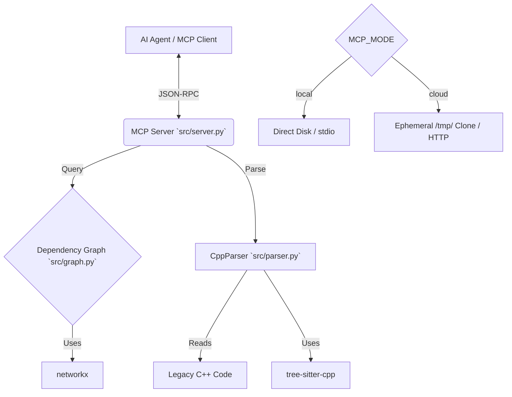

# LegacyGraph-MCP Project Manual

## 1. Project Overview
LegacyGraph-MCP is a tool designed to bridge the gap between AI Agents and legacy C++ codebases. By exposing a code dependency graph via the Model Context Protocol (MCP), it allows LLMs to "reason" about code structure rather than just reading text.

### Key Capabilities
- **Robust Parsing:** Handles dirty/broken C++ code using `tree-sitter`.
- **Structural Analysis:** Maps function call graphs (Caller/Callee relationships).
- **Cycle Detection:** Identifies recursion and spaghetti code loops.
- **Agent Integration:** Standardized MCP interface for tools like Claude Desktop or custom agents.
- **Hybrid Deployment:** Runs in **local mode** (stdio, direct disk) or **cloud mode** (HTTP, ephemeral clones).
- **Omni-Ingestion:** Clone repos via URL, apply patches, accept raw file snippets, or scan local directories.
- **Token-Safe Visuals:** Bounded Mermaid.js graph generation — inline for cloud, file export for local IDEs.

## 2. Hands-on Guide

### Prerequisites
- Python 3.11+
- Poetry (for dependency management)
- Git (for cloud-mode repo cloning)

### Installation
```bash
git clone https://github.com/RohitYadav34980/LegacyGraph-MCP.git
cd LegacyGraph-MCP
poetry install
```

### Running the Server

#### Local Mode (Cursor / Claude Desktop — `stdio`)
```bash
poetry run python -m src.server --mode local
```
Uses stdio transport and direct disk access. Best for local AI clients.

#### Cloud Mode (Smithery / Render — `streamable-http`)
```bash
poetry run python -m src.server --mode cloud
```
Uses HTTP transport. Repos are cloned into ephemeral `/tmp/` directories and deleted after parsing. The `directory_path` parameter is blocked in this mode.

#### Advanced Transport Overrides
```bash
# Force SSE transport in local mode
poetry run python -m src.server --mode local --transport sse --path /mcp

# Force streamable-http in local mode
poetry run python -m src.server --mode local --transport streamable-http
```

### Verifying Installation
```bash
poetry run python tools/verifier.py
```

Expected output: **100% accuracy** on dependency detection.

## 3. Architecture

### High-Level Design

```mermaid
graph TD
    A[AI Agent / MCP Client] <-->|JSON-RPC| B(MCP Server `src/server.py`);
    B -->|Query| C{Dependency Graph `src/graph.py`};
    B -->|Parse| D[CppParser `src/parser.py`];
    D -->|Reads| E[Legacy C++ Code];
    D -->|Uses| F[tree-sitter-cpp];
    C -->|Uses| G[networkx];
    H{MCP_MODE} -->|local| I[Direct Disk / stdio];
    H -->|cloud| J[Ephemeral /tmp/ Clone / HTTP];
```

### Component Breakdown

#### `src/parser.py` (Ingestion Layer)
- **Class:** `CppParser`
- **Purpose:** Extracts function signatures and call sites.
- **Key Method:** `parse_source(code: str) -> List[Tuple[str, Set[str]]]`
- **Robustness:** Uses tree-sitter Queries `(function_definition)` and `(call_expression)` to tolerate syntax errors.

#### `src/graph.py` (Analysis Layer)
- **Class:** `DependencyGraph`
- **Purpose:** Directed Graph data structure for dependencies.
- **Key Methods:**
    - `build_from_parsed_data(data, filepath)`: File-tagged node construction.
    - `detect_cycles()`: Finds recursive loops.
    - `get_upstream_callers(func)`: Who calls `func`?
    - `get_downstream_dependencies(func)`: Who does `func` call?
    - `get_file_subgraph(filepath)`: Isolate a single file's functions.
    - `get_cross_file_dependencies()`: Find inter-file coupling.

#### `src/server.py` (Interface Layer)
- **Framework:** `mcp` (FastMCP)
- **Deployment Variable:** `MCP_MODE` (`local` / `cloud`)
- **Tools Exposed:**
    - `analyze_codebase`: Unified ingestion (repo_url, patch_content, raw_files, directory_path).
    - `get_file_functions`: List functions in a specific file.
    - `get_file_coupling`: Cross-file dependency report.
    - `get_callers`: Upstream analysis.
    - `get_callees`: Downstream analysis.
    - `detect_cycles`: Architectural health check.
    - `get_orphan_functions`: Find unused code.
    - `generate_mermaid_graph`: Inline Mermaid string (cloud-friendly).
    - `export_ide_graph`: Save Mermaid `.md` file to disk (local only).

## 4. API Reference

### `analyze_codebase(...)`
**Description:** Unified tool for ingesting C++ code from any source.

| Parameter | Type | Description |
|---|---|---|
| `repo_url` | `str` (optional) | HTTPS URL of a git repo to clone. |
| `patch_content` | `str` (optional) | A unified diff to apply on top of a cloned repo. Requires `repo_url`. |
| `raw_files` | `List[Dict]` (optional) | `[{"filename": "main.cpp", "content": "..."}]` for small projects. |
| `directory_path` | `str` (optional) | Absolute local path. **Rejected in cloud mode.** |

**Returns:** Status string with file count and function count.

### `get_file_functions(filepath: str)`
**Description:** Lists all functions defined in a specific source file (use relative paths from ingestion).

### `get_file_coupling()`
**Description:** Aggregated cross-file coupling report (e.g., `main.cpp -> utils.cpp (3 call(s))`).

### `get_callers(function_name: str)`
**Description:** Lists all functions that invoke `function_name`.

### `get_callees(function_name: str)`
**Description:** Lists all functions called by `function_name`.

### `detect_cycles()`
**Description:** Scans the graph for any circular paths.

### `get_orphan_functions()`
**Description:** Finds functions that are defined but never called.

### `generate_mermaid_graph(focus_node?, max_depth?)`
**Description:** Returns a Mermaid.js diagram as an inline markdown string. Use `focus_node` and `max_depth` to limit output size.

### `export_ide_graph(output_filename, focus_node?, max_depth?)`
**Description:** Writes a Mermaid `.md` file to the local disk. **Local mode only.** Returns a message telling the user to open it in their IDE's Markdown Preview.

## 5. Deployment Modes

| | Local Mode | Cloud Mode |
|---|---|---|
| **Transport** | `stdio` (default) | `streamable-http` (default) |
| **Ingestion** | All inputs accepted | `directory_path` blocked |
| **Repo Cloning** | Supported | Supported (ephemeral `/tmp/`) |
| **Mermaid** | `export_ide_graph` (file) + `generate_mermaid_graph` (inline) | `generate_mermaid_graph` only |
| **Config** | `--mode local` or `MCP_MODE=local` | `--mode cloud` or `MCP_MODE=cloud` |

## 6. Testing & Verification
The project includes a comprehensive test suite using `pytest`.
- **Run Tests:** `poetry run pytest`
- **Coverage:** Includes edge cases for recursion, orphans, broken syntax, hybrid mode guards, raw file ingestion, and Mermaid generation.

## 7. Development & Contributing
### Standards
- **Code Style:** Strict `mypy` typing and Google-style docstrings are enforced.
- **Testing:** New features must include `pytest` cases covering edge scenarios.
- **Version Control:**
    - `main`: Stable, production-ready code.
    - Feature branches: `feature/your-feature-name`.
### Commit Protocol
Follow conventional commits (e.g., `feat: add template parsing`, `fix: resolve parser timeout`).
