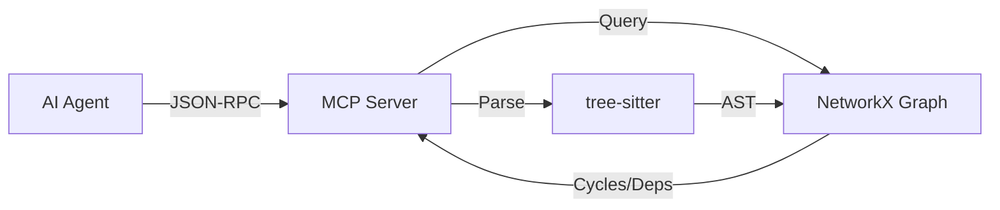

# LegacyGraph-MCP: Agentic C++ Modernization 🏗️

[](https://www.python.org/downloads/)
[](https://modelcontextprotocol.io/)
[](https://github.com/psf/black)

## ⚡ The Problem
Legacy modernization using standard LLMs fails because:
1.  **Lost Context:** "Spaghetti code" (intertwined dependencies) cannot fit in a context window.
2.  **Hallucinations:** Agents refactor functions without knowing upstream dependencies, causing breakage.
3.  **Text vs. Logic:** Regex-based parsers miss nuances in C++ macros and templates.

## 🛠️ The Solution
**LegacyGraph-MCP** is a Model Context Protocol (MCP) server that exposes a C++ codebase as a **Knowledge Graph** to AI Agents.

Instead of reading text, the Agent queries the structure:
> *"Agent: Which functions call `calculate_risk()`?"*
> 
> *"MCP: `process_loan()` and `assess_credit()`"*

### Features
* **AST Parsing:** Uses `tree-sitter` for 100% accurate C++ parsing (no Regex).
* **Graph RAG:** Detects **Circular Dependencies** before refactoring begins.
* **Universal Compatibility:** Works with Claude Desktop, DeepSeek-Coder, and any MCP client.

---

## 🚀 Quick Start

### 1. Install
```bash
git clone https://github.com/RohitYadav34980/LegacyGraph-MCP.git
cd LegacyGraph-MCP
poetry install
```

### 2. Run Server
```bash
poetry run python -m src.server
```

### 3. Verify Installation
```bash
poetry run python tools/verifier.py
```

Expected output: **100% accuracy** on dependency detection.

---

## 📊 Architecture



### Three-Layer Design
1. **Ingestion Layer** (`src/parser.py`): Tree-sitter-based C++ parsing
2. **Graph Layer** (`src/graph.py`): NetworkX dependency graph
3. **Interface Layer** (`src/server.py`): MCP tool exposure

---

## 🔧 MCP Tools

| Tool                | Description                          | Example Query                       |
|---------------------|--------------------------------------|-------------------------------------|
| `analyze_codebase`  | Parses C++ and builds graph          | Analyze entire project              |
| `get_callers`       | Find upstream dependencies           | Who calls `validate()`?             |
| `get_callees`       | Find downstream dependencies         | What does `init()` call?            |
| `detect_cycles`     | Identify circular dependencies       | Are there any loops?                |
| `get_orphan_functions` | Find unused code                  | Which functions are never called?   |

---

## 🧪 Testing

### Run All Tests
```bash
poetry run pytest
```

### Run Verifier (Integration Test)
```bash
poetry run python tools/verifier.py
```

Verifies against a sample legacy C++ project in `data/legacy_project/`.

**Current Accuracy:** 100% (10/10 dependencies + cycle detection + orphan detection)

---

## 🤝 Contributing

1. **Fork & Clone**
2. **Create Feature Branch:** `git checkout -b feature/your-feature`
3. **Follow Standards:**
   - Strict `mypy` typing
   - Google-style docstrings
   - Conventional commits (e.g., `feat: add template parsing`)
4. **Test:** Ensure `pytest` passes
5. **Submit PR**

---

## 📚 Documentation

- **[Project Manual](PROJECT_MANUAL.md)**: In-depth guide and API reference
- **[Implementation Plan](https://github.com/RohitYadav34980/LegacyGraph-MCP/tree/main)**: Original design decisions

---

## 🙏 Acknowledgments

Built with:
- [tree-sitter](https://tree-sitter.github.io/tree-sitter/) - Incremental parsing
- [NetworkX](https://networkx.org/) - Graph algorithms
- [MCP](https://modelcontextprotocol.io/) - Model Context Protocol

---

**Made for McKinsey LegacyX** 🚀
