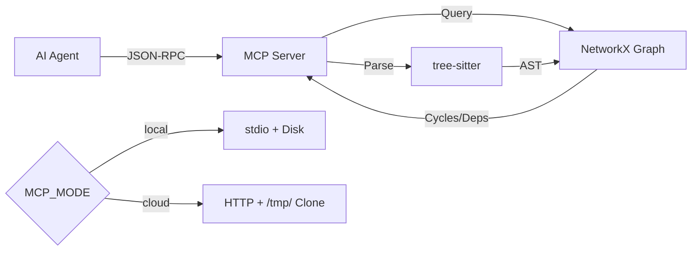

# LegacyGraph-MCP: Agentic C++ Modernization 🏗️

[](https://www.python.org/downloads/)
[](https://modelcontextprotocol.io/)
[](https://github.com/psf/black)
[](https://smithery.ai/servers/labsofuniverse/legacy-mcp-analyzer)

## ⚡ The Problem

Legacy modernization using standard LLMs fails because:
1. **Lost Context:** "Spaghetti code" (intertwined dependencies) cannot fit in a context window.
2. **Hallucinations:** Agents refactor functions without knowing upstream dependencies, causing breakage.
3. **Text vs. Logic:** Regex-based parsers miss nuances in C++ macros and templates.

## 🛠️ The Solution

**LegacyGraph-MCP** is a Model Context Protocol (MCP) server that exposes a C++ codebase as a **Knowledge Graph** to AI Agents.

Instead of reading text, the Agent queries the structure:
> *"Agent: Which functions call `calculate_risk()`?"*
>
> *"MCP: `process_loan()` and `assess_credit()`"*

### Features
* **AST Parsing:** Uses `tree-sitter` for 100% accurate C++ parsing (no Regex).
* **Graph RAG:** Detects **Circular Dependencies** before refactoring begins.
* **Universal Compatibility:** Works with Claude Desktop, DeepSeek-Coder, and any MCP client.
* **Hybrid Deployment:** Runs locally (stdio) or in the cloud (HTTP) — one codebase, two modes.
* **Omni-Ingestion:** Clone repos, apply patches, upload raw files, or scan local directories.
* **Token-Safe Visuals:** Bounded Mermaid.js graphs returned inline (cloud) or saved to disk (local).

---

## 📐 Architecture

```
src/
├── __init__.py              # Package root
├── __main__.py              # CLI entry point (python -m src)
├── server.py                # MCP registration & server card
│
├── core/                    # Business logic
│   ├── graph.py             # NetworkX dependency graph model
│   └── parser.py            # Tree-sitter C++ parser
│
├── tools/                   # MCP tool functions
│   ├── analysis.py          # analyze_codebase (ingestion)
│   ├── queries.py           # get_callers, get_callees, detect_cycles, etc.
│   └── export.py            # Mermaid graph generation & export
│
└── utils/                   # Cross-cutting infrastructure
    ├── config.py             # MCP_MODE, CPP_EXTENSIONS
    ├── logger.py             # Centralized logging
    ├── services.py           # Global singletons (graph, parser)
    └── helpers.py            # git clone, directory scanning, Mermaid builder
```


```mermaid
graph LR
    A[AI Agent] -->|JSON-RPC| B[MCP Server]
    B -->|Parse| C[tree-sitter]
    B -->|Query| D[NetworkX Graph]
    C -->|AST| D
    D -->|Cycles/Deps| B
    E{MCP_MODE} -->|local| F[stdio + Disk]
    E -->|cloud| G[HTTP + /tmp/ Clone]
```

> 📖 **Deep-dive:** See [ARCHITECTURE.md](ARCHITECTURE.md) for detailed component diagrams and data flows.

---

## 🚀 Quick Start

### 1. Install

```bash
git clone https://github.com/RohitYadav34980/LegacyGraph-MCP.git
cd LegacyGraph-MCP
pip install poetry && poetry install
```

### 2. Run Server

#### Local Mode (Cursor / Claude Desktop)
```bash
# Default: stdio transport, direct disk access
python -m src --mode local
```

#### Cloud Mode (Smithery / Render)
```bash
# Default: streamable-http transport, ephemeral clones
python -m src --mode cloud
```

#### Override Transport
```bash
# Force streamable-http in local mode
python -m src --mode local --transport streamable-http

# Force SSE
python -m src --mode cloud --transport sse --path /mcp
```

#### Deploying on Render (or any PaaS)
Set `MCP_MODE=cloud` as an environment variable. The HTTP server binds to `0.0.0.0:$PORT` automatically.

### 3. Verify Installation
```bash
python -m pytest tests/ -v
python tools/verifier.py
```

Expected output: **100% accuracy** on dependency detection.

---

## 🔌 Installing in Your MCP Client

### Option 1: Install via Smithery (Recommended)

```bash
npx -y @smithery/cli@latest mcp add labsofuniverse/legacy-mcp-analyzer --client claude-code
```

### Option 2: Manual Configuration

Add to your `claude_desktop_config.json`:
```json
{
  "mcpServers": {
    "legacy-mcp-analyzer": {
      "command": "python",
      "args": ["-m", "src", "--mode", "local"],
      "cwd": "/path/to/LegacyGraph-MCP"
    }
  }
}
```

---

## 🔧 MCP Tools

| Tool                     | Description                                                   | Mode        |
|--------------------------|---------------------------------------------------------------|-------------|
| `analyze_codebase`       | Unified ingestion: repo_url, patch, raw_files, or local dir   | Both        |
| `get_file_functions`     | List functions defined in a specific source file               | Both        |
| `get_file_coupling`      | Cross-file coupling report (file A → file B)                  | Both        |
| `get_callers`            | Find upstream dependencies                                     | Both        |
| `get_callees`            | Find downstream dependencies                                   | Both        |
| `detect_cycles`          | Identify circular dependencies                                 | Both        |
| `get_orphan_functions`   | Find unused code                                               | Both        |
| `generate_mermaid_graph` | Return Mermaid diagram inline (token-safe)                     | Both        |
| `export_ide_graph`       | Save Mermaid `.md` file to local disk                          | Local only  |

---

## 🧪 Testing

```bash
# Unit + integration tests (20 test cases)
python -m pytest tests/ -v

# End-to-end verifier against sample legacy project
python tools/verifier.py
```

**Current Accuracy:** 100% (10/10 dependencies + cycle detection + orphan detection)

---

## 📚 Documentation

| Document | Description |
|---|---|
| [PROJECT_MANUAL.md](PROJECT_MANUAL.md) | In-depth guide, API reference, deployment modes |
| [ARCHITECTURE.md](ARCHITECTURE.md) | Detailed architecture, data flows, component diagrams |
| [CONTRIBUTING.md](CONTRIBUTING.md) | Development standards, commit protocol, PR process |
| [CHANGELOG.md](CHANGELOG.md) | Version history and release notes |

---

## 🤝 Contributing

See [CONTRIBUTING.md](CONTRIBUTING.md) for full details. Quick summary:

1. Fork & clone
2. Create feature branch: `git checkout -b feature/your-feature`
3. Follow: strict `mypy` typing, Google-style docstrings, conventional commits
4. Test: ensure `pytest` passes
5. Submit PR

---

## 🙏 Acknowledgments

Built with:
- [tree-sitter](https://tree-sitter.github.io/tree-sitter/) — Incremental parsing
- [NetworkX](https://networkx.org/) — Graph algorithms
- [MCP](https://modelcontextprotocol.io/) — Model Context Protocol
- [FastMCP](https://github.com/jlowin/fastmcp) — MCP server framework

---

**Made with ❤️**
