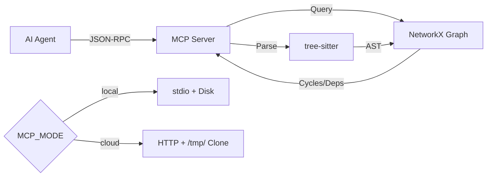

# LegacyGraph-MCP: Agentic C++ Modernization 🏗️

[](https://www.python.org/downloads/)
[](https://modelcontextprotocol.io/)
[](https://github.com/psf/black)
[](https://smithery.ai/servers/labsofuniverse/legacy-mcp-analyzer)

## ⚡ The Problem
Legacy modernization using standard LLMs fails because:
1.  **Lost Context:** "Spaghetti code" (intertwined dependencies) cannot fit in a context window.
2.  **Hallucinations:** Agents refactor functions without knowing upstream dependencies, causing breakage.
3.  **Text vs. Logic:** Regex-based parsers miss nuances in C++ macros and templates.

## 🛠️ The Solution
**LegacyGraph-MCP** is a Model Context Protocol (MCP) server that exposes a C++ codebase as a **Knowledge Graph** to AI Agents.

Instead of reading text, the Agent queries the structure:
> *"Agent: Which functions call `calculate_risk()`?"*
> 
> *"MCP: `process_loan()` and `assess_credit()`"*

### Features
* **AST Parsing:** Uses `tree-sitter` for 100% accurate C++ parsing (no Regex).
* **Graph RAG:** Detects **Circular Dependencies** before refactoring begins.
* **Universal Compatibility:** Works with Claude Desktop, DeepSeek-Coder, and any MCP client.
* **Hybrid Deployment:** Runs locally (stdio) or in the cloud (HTTP) — one codebase, two modes.
* **Omni-Ingestion:** Clone repos, apply patches, upload raw files, or scan local directories.
* **Token-Safe Visuals:** Bounded Mermaid.js graphs returned inline (cloud) or saved to disk (local).

---

## 🚀 Quick Start

### 1. Install
```bash
git clone https://github.com/RohitYadav34980/LegacyGraph-MCP.git
cd LegacyGraph-MCP
poetry install
```

### 2. Run Server

#### Local Mode (Cursor / Claude Desktop)
```bash
# Default: stdio transport, direct disk access
poetry run python -m src.server --mode local
```

#### Cloud Mode (Smithery / Render)
```bash
# Default: streamable-http transport, ephemeral clones
poetry run python -m src.server --mode cloud
```

#### Override Transport
```bash
# Force streamable-http in local mode
poetry run python -m src.server --mode local --transport streamable-http

# Force SSE
poetry run python -m src.server --mode cloud --transport sse --path /mcp
```

#### Deploying on Render (or any PaaS)
Set `MCP_MODE=cloud` as an environment variable. The HTTP server binds to `0.0.0.0:$PORT` automatically.

### 3. Verify Installation
```bash
poetry run python tools/verifier.py
```

Expected output: **100% accuracy** on dependency detection.

---

## 🔌 Installing in your MCP Client

### Option 1: Install via Smithery (Recommended)

To install LegacyGraph-MCP for Claude Desktop automatically via [Smithery](https://legacy-mcp-analyzer--labsofuniverse.run.tools):

```bash
npx -y @smithery/cli@latest mcp add labsofuniverse/legacy-mcp-analyzer --client claude-code
```

### Option 2: Manual Configuration

1. Clone the repository and install dependencies:
```bash
git clone https://github.com/RohitYadav34980/LegacyGraph-MCP.git
cd LegacyGraph-MCP
poetry install
```

2. Add the following to your `claude_desktop_config.json`:
```json
{
  "mcpServers": {
    "legacy-mcp-analyzer": {
      "command": "poetry",
      "args": ["run", "python", "-m", "src.server", "--mode", "local"],
      "cwd": "/path/to/LegacyGraph-MCP"
    }
  }
}
```

Replace `/path/to/LegacyGraph-MCP` with the actual path to your cloned directory.

---

## 📊 Architecture


```mermaid
graph LR
    A[AI Agent] -->|JSON-RPC| B[MCP Server]
    B -->|Parse| C[tree-sitter]
    B -->|Query| D[NetworkX Graph]
    C -->|AST| D
    D -->|Cycles/Deps| B
    E{MCP_MODE} -->|local| F[stdio + Disk]
    E -->|cloud| G[HTTP + /tmp/ Clone]
```

### Three-Layer Design
1. **Ingestion Layer** (`src/parser.py`): Tree-sitter-based C++ parsing
2. **Graph Layer** (`src/graph.py`): File-aware NetworkX dependency graph
3. **Interface Layer** (`src/server.py`): MCP tool exposure with hybrid cloud/local mode

---

## 🔧 MCP Tools

| Tool                     | Description                                                   | Mode        |
|--------------------------|---------------------------------------------------------------|-------------|
| `analyze_codebase`       | Unified ingestion: repo_url, patch, raw_files, or local dir   | Both        |
| `get_file_functions`     | List functions defined in a specific source file               | Both        |
| `get_file_coupling`      | Cross-file coupling report (file A → file B)                  | Both        |
| `get_callers`            | Find upstream dependencies                                     | Both        |
| `get_callees`            | Find downstream dependencies                                   | Both        |
| `detect_cycles`          | Identify circular dependencies                                 | Both        |
| `get_orphan_functions`   | Find unused code                                               | Both        |
| `generate_mermaid_graph` | Return Mermaid diagram inline (token-safe)                     | Both        |
| `export_ide_graph`       | Save Mermaid `.md` file to local disk                          | Local only  |

---

## 🧪 Testing

### Run All Tests
```bash
poetry run pytest
```

### Run Verifier (Integration Test)
```bash
poetry run python tools/verifier.py
```

Verifies against a sample legacy C++ project in `data/legacy_project/`.

**Current Accuracy:** 100% (10/10 dependencies + cycle detection + orphan detection)

---

## 🤝 Contributing

1. **Fork & Clone**
2. **Create Feature Branch:** `git checkout -b feature/your-feature`
3. **Follow Standards:**
   - Strict `mypy` typing
   - Google-style docstrings
   - Conventional commits (e.g., `feat: add template parsing`)
4. **Test:** Ensure `pytest` passes
5. **Submit PR**

---

## 📚 Documentation

- **[Project Manual](PROJECT_MANUAL.md)**: In-depth guide, API reference, and deployment modes
- **[Implementation Plan](https://github.com/RohitYadav34980/LegacyGraph-MCP/tree/main)**: Original design decisions

---

## 🙏 Acknowledgments

Built with:
- [tree-sitter](https://tree-sitter.github.io/tree-sitter/) - Incremental parsing
- [NetworkX](https://networkx.org/) - Graph algorithms
- [MCP](https://modelcontextprotocol.io/) - Model Context Protocol

---

**Made with ❤️** 
