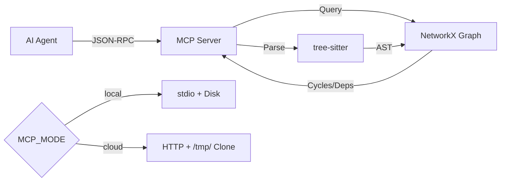

# LegacyGraph-MCP: Agentic C++ Modernization 🏗️

[](https://www.python.org/downloads/)
[](https://modelcontextprotocol.io/)

[](https://github.com/psf/black)
[](https://smithery.ai/servers/labsofuniverse/legacy-mcp-analyzer)

## ⚡ The Problem

Legacy C++ codebases are too large for LLM context windows, leading to:
1. **Lost Context** – spaghetti code cannot be processed in one pass.
2. **Hallucinations** – agents refactor without full dependency awareness.
3. **Parsing Gaps** – regex‑based parsers miss macros and templates.

## 🛠️ The Solution

**LegacyGraph‑MCP** is a Model Context Protocol (MCP) server that exposes a C++ codebase as a **knowledge graph**. Agents query the graph instead of raw text:
> *"Agent: Which functions call `calculate_risk()`?"*
> *"MCP: `process_loan()` and `assess_credit()`"*

### Core Features
- **Accurate AST parsing** via `tree‑sitter` – 100 % C++ syntax coverage.
- **Graph‑RAG** – detects circular dependencies before refactoring.
- **Hybrid deployment** – local (stdio) or cloud (HTTP) with a single codebase.
- **Universal MCP client support** – works with Claude Desktop, DeepSeek‑Coder, etc.
- **Omni‑ingestion** – clone repos, apply patches, upload raw files, or scan local directories.
- **Token‑safe visualisation** – Mermaid diagrams returned inline (cloud) or saved to disk (local).

---

## 📊 Performance (LLVM – 67 k files)

LegacyGraph‑MCP now uses **JSON** for cache files (`.legacygraph.json`) instead of unsafe pickle, and supports a constrained‑resource benchmark profile.

| Metric | Sequential (v0.1) | Distributed (v0.3) | ⚡ Improvement |
|---|---|---|---|
| **CPU Utilisation** | `~6 % (1 core)` | `~80 % dynamic cores` | Adaptive |
| **AST Build Time** | `5 h` | `10 min` | `≈30×` |
| **Throughput** | `3.8 files/s` | `113 files/s` | `≈30×` |
| **Incremental Updates** | N/A | `< 1 s` | Instant |

---

## 📐 Architecture

```
src/
├── __init__.py            # package root
├── __main__.py            # CLI entry point (python -m src)
├── server.py              # MCP registration & server card
│
├── core/                  # business logic
│   ├── graph.py           # NetworkX dependency graph model
│   └── parser.py          # tree‑sitter C++ parser
│
├── tools/                 # MCP tool functions
│   ├── analysis.py        # analyze_codebase (ingestion)
│   ├── queries.py         # get_callers, get_callees, detect_cycles …
│   └── export.py          # Mermaid graph generation & export
│
└── utils/                 # cross‑cutting infrastructure
    ├── config.py          # MCP_MODE, CPP_EXTENSIONS
    ├── logger.py          # centralized logging
    ├── services.py        # singletons (graph, parser)
    └── helpers.py         # git clone, directory scanning, Mermaid builder
```


```mermaid
graph LR
    A[AI Agent] -->|JSON‑RPC| B[MCP Server]
    B -->|Parse| C[tree‑sitter]
    B -->|Query| D[NetworkX Graph]
    C -->|AST| D
    D -->|Cycles/Deps| B
    E{MCP_MODE} -->|local| F[stdio + Disk]
    E -->|cloud| G[HTTP + /tmp/ Clone]
```

> 📖 See [`ARCHITECTURE.md`](ARCHITECTURE.md) for detailed component diagrams.

---

## 👨‍💻 Developer Guide (Run & Develop)

This section helps developers run the code directly, develop the server, and test it locally.

### 1. Prerequisites and Installation
Ensure you have Python 3.11+ and `poetry` installed.

```bash
git clone https://github.com/RohitYadav34980/LegacyGraph-MCP.git
cd LegacyGraph-MCP

# Install dependencies using Poetry
pip install poetry
poetry install
```

### 2. Running the Server Locally
To develop or verify the MCP server running natively:

#### Standard Local Execution (stdio)
```bash
python -m src --mode local
```

#### Cloud Simulation Mode (HTTP / SSE)
Test the cloud endpoints locally without Docker:
```bash
python -m src --mode cloud --transport http --path /mcp --host 127.0.0.1 --port 7860
```
(`--transport streamable-http` is accepted as an alias for `http`; `sse` remains available for legacy clients.)
This forces the server to bind to `localhost:7860`, mimicking the Hugging Face Spaces environment.

### 3. Verify Server State
Test if your local setup works perfectly:
```bash
# Run the internal validation script
python tools/verifier.py
```
Expected output: **100 % accuracy** on dependency detection.

---

## ☁️ Cloud Deployment (Hugging Face Spaces)

This project is optimized for **Hugging Face Spaces** using the Docker SDK.

### 1. Create a Space
Create a new Space on [huggingface.co](https://huggingface.co/new-space) and select **Docker** as the SDK.

### 2. Connect & Push
The easiest way is to push your existing local repository to the Space:
```bash
# Add the Hugging Face Space as a remote
git remote add hf https://huggingface.co/spaces/Rohitadav/GraphPulse

# Push your code (requires an HF Access Token)
git push hf main --force
```

### 3. Verify
Once pushed, the Space will automatically build the `Dockerfile` and start the server on port `7860`. You can then consume this server via **SSE** in any MCP-compatible client.

---

## 🔌 Installing in Your MCP Client

Connect your AI agent to the Graph engine using these configurations.

### Option 1: Connect via Smithery (For Remote / Cloud)
If you've deployed to Hugging Face or another remote hosting, or just want to use the published Remote MCP setup, use Smithery. You can [view the server directly on Smithery](https://smithery.ai/servers/labsofuniverse/legacy-mcp-analyzer).

```bash
npx -y @smithery/cli@latest mcp add labsofuniverse/legacy-mcp-analyzer --client claude-code
```

### Option 2: Local / Claude Desktop Configuration
If you want to plug your local development environment directly into Claude Desktop, update your configuration file. 
- **macOS**: `~/Library/Application Support/Claude/claude_desktop_config.json`
- **Windows**: `%APPDATA%\Claude\claude_desktop_config.json`

Add the following configuration, ensuring you **replace the `cwd` paths** with the absolute path where you cloned this repository.

```json
{
  "mcpServers": {
    "legacy-mcp-analyzer": {
      "command": "python",
      "args": [
        "-m", 
        "src", 
        "--mode", 
        "local"
      ],
      "cwd": "C:\\path\\to\\your\\LegacyGraph-MCP"
    }
  }
}
```
*Note: Make sure to escape backslashes on Windows (e.g. `C:\\Users\\...`), or use forward slashes on macOS/Linux.*

---

## 🔧 MCP Tools
| Tool | Description | Mode |
|---|---|---|
| `analyze_codebase` | Unified ingestion (repo URL, patch, raw files, or local dir) | Both |
| `get_file_functions` | List functions defined in a specific source file | Both |
| `get_file_coupling` | Cross‑file coupling report (file A → file B) | Both |
| `get_callers` | Find upstream dependencies | Both |
| `get_callees` | Find downstream dependencies | Both |
| `detect_cycles` | Identify circular dependencies | Both |
| `get_orphan_functions` | Find unused code | Both |
| `generate_mermaid_graph` | Return Mermaid diagram inline (token‑safe) | Both |
| `export_ide_graph` | Save Mermaid `.md` file to local disk | Local only |

---

## 🧪 Testing
```bash
# Unit + integration tests (≈30 cases)
python -m pytest tests/ -v

# End‑to‑end verifier against sample legacy project
python tools/verifier.py
```
**Current Accuracy:** 100 % (all dependencies, cycles, and orphan detection verified).

---

## 📚 Documentation
Review the complete documentation suite for deep-dives into the architecture and usage:

| Document | Description |
|---|---|
| [`PROJECT_MANUAL.md`](PROJECT_MANUAL.md) | In‑depth guide, API reference, deployment modes |
| [`ARCHITECTURE.md`](ARCHITECTURE.md) | Detailed architecture, data flows, component diagrams |
| [`CONTRIBUTING.md`](CONTRIBUTING.md) | Development standards, commit protocol, PR process |
| [`CHANGELOG.md`](CHANGELOG.md) | Version history and release notes |

---

## 🤝 Contributing
1. Fork & clone the repo.
2. Create a feature branch: `git checkout -b feature/your-feature`.
3. Follow strict `mypy` typing, Google‑style docstrings, conventional commits.
4. Run `pytest` – ensure all tests pass.
5. Submit a PR.

---

## 🙏 Acknowledgments
Built with:
- [tree‑sitter](https://tree-sitter.github.io/tree-sitter/)
- [NetworkX](https://networkx.org/)
- [MCP](https://modelcontextprotocol.io/)
- [FastMCP](https://github.com/jlowin/fastmcp)
  
---

**Made with ❤️**

<div align="center">
  <p>Thanks for visiting!</p>
  
</div>
